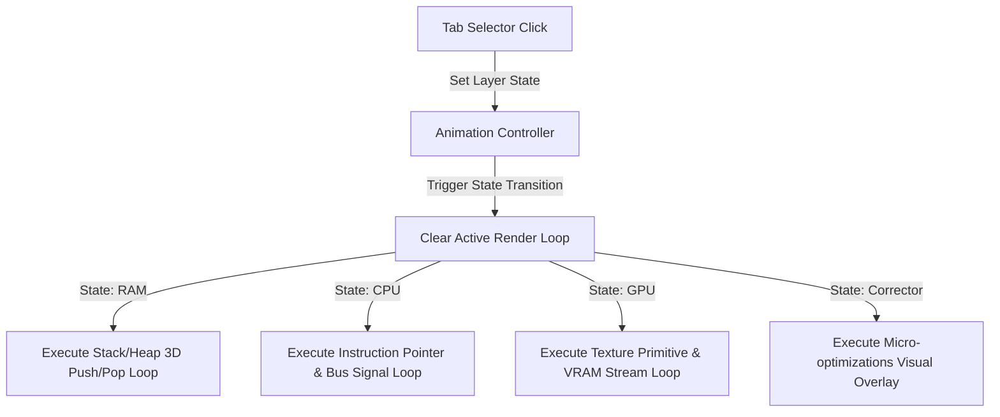

# Research & Decisions: Interactive Visual Scenes Refactor (CS-Bridge)

This document resolves technical details and research options for implementing the interactive visual scenes.

## 1. Technical Decisions & Rationale

### Three.js vs. Canvas 2D vs. CSS 3D Transforms
- **Decision**: Use **Three.js** (via CDN) for scenes requiring true 3D spatial representations (e.g. 3D grid layout of memory blocks, spatial data cores) and fall back to advanced **CSS 3D Transforms** + **Canvas 2D** for flat layouts to optimize performance.
- **Rationale**: Three.js provides a robust WebGL abstraction that easily represents coordinate systems, depth buffers, lighting, and camera rotations. This matches the user's specific request for true 3D visualization.
- **Alternatives Considered**: 
  - *Canvas 2D*: Rejected for complex layouts because drawing isometric projections manually is error-prone.
  - *Raw WebGL*: Rejected due to excessive boilerplate code required in self-contained files.

### Self-Contained Deployment vs. Build Pipeline
- **Decision**: Strict Option B - **No build scripts**. Each file is generated as a standalone entity containing all HTML markup, inline styles, custom JS animation loops, and scripts.
- **Rationale**: Portability is paramount. Standard students or instructors double-click these files to run them. Offline loading works immediately when libraries are cached or when fallbacks are loaded.
- **Alternatives Considered**: 
  - *Vite/Webpack bundler*: Rejected since it complicates the delivery, requiring node_modules to run or view the files.

### LaTeX Math Rendering
- **Decision**: Client-side **KaTeX** using automatic delimiter parsing on load.
- **Rationale**: KaTeX is significantly faster than MathJax, ensuring page loads stay under 1.5 seconds.
- **Alternatives Considered**: 
  - *Pre-rendered SVGs*: Rejected because dynamic text inputs and sliders must update variables inside formulas in real-time.

---

## 2. Dynamic Layer-Switching Architecture

To enable interactive switching between the 4 hardware layers, each page will implement a state-driven animation controller:

### Animation Loop Reset and Re-routing Best Practices
- Every HTML file will declare a global `activeRenderState` variable.
- Switching tabs triggers a clean teardown of the active Three.js scene (disposing of geometries, materials, and stopping active `requestAnimationFrame` IDs).
- The target layer initialization function is then invoked, instantiating the new camera angles, objects, and lighting corresponding to that hardware view.
